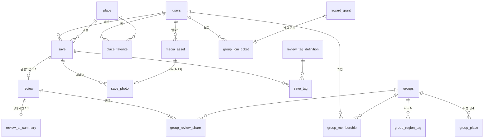

# DB 스키마 설계 v1 (TMT-93)

> PostgreSQL 16 + PostGIS. [도메인 설계 v2](https://ttalkkak.atlassian.net/wiki/spaces/ttalkkak/pages/57049090)의 애그리거트·상태·트랜잭션(규칙 번호 C4, T5, G14 … 는 그 문서)과 API 명세 v2 6종의 조회 패턴을 입력으로 삼는다.
> 이 문서는 **구조와 결정의 근거**가 정본이고, 실행 가능한 마이그레이션 스크립트(베이스라인·시드)는 TMT-96에서 확정한다.

## 0. 전제

- **RDS 없이 EC2 + `postgis/postgis:16-3.4` 컨테이너** (TMT-61). 확장은 `postgis`만 켜고 `pgvector`는 v2 보류 — 다만 컬럼 추가만으로 확장 가능하게 테이블을 자른다
- 좌표는 **EPSG:4326 `geography(Point)`** 로 통일 (P4). 반경 1km 검색(E1)이 `ST_DWithin`으로 미터 단위 그대로 떨어진다
- ID는 전부 `BIGINT IDENTITY`. API의 `place_1`·`review_9` 표기는 **표현 계층의 접두사**이고 DB에 문자열 ID를 두지 않는다
- 시각은 전부 `timestamptz`

## 1. ERD



## 2. 핵심 설계 결정

### D1. Save가 내용을 소유하고, Review는 얇다 — 관계의 방향은 `review.save_id`

도메인 v2 §3: 사진·태그·별점·본문은 전부 `Save` 소유, `Review`는 "완성됐다는 사실"만. 도메인 문서와 API는 `Save.reviewId`로 말하지만, **DB의 정본은 `review.save_id UNIQUE` 단방향 FK**로 둔다.

- 순환 FK(save → review → save)가 사라진다. INSERT 순서 문제도 deferred constraint도 필요 없다
- `Save.reviewId IS NULL` 판별(S3)은 `LEFT JOIN review` 로 동일하게 성립하고, JPA에선 `@OneToOne(mappedBy)` 매핑이라 애플리케이션 코드는 도메인 문서 그대로 읽힌다
- 리뷰 불변성(S4)은 "review 행이 존재하는 save는 UPDATE 금지"를 서비스 레이어에서 강제

### D2. 티켓 잔액의 정본은 행의 집합 (T5) — 카운터 컬럼 없음

`group_join_ticket`의 `status='AVAILABLE'` 행 수가 잔액이다. 소비(TX-3)·회수(TX-5)는 **조건부 UPDATE의 영향 행 수**로 원자성을 보장하므로 별도 잠금이 없다. `(user_id, status, id)` 인덱스가 "발급 오래된 순 1장"(T7)과 잔액 COUNT를 함께 받친다. 발급 근거는 `reward_grant`가 `(source_type, source_id, reward_type)` UNIQUE로 이중 발급을 차단한다 (T8) — 회원가입 1장(T2)도 `SIGNUP` grant로 같은 경로를 쓴다.

### D3. 집계는 컬럼으로 두고 같은 트랜잭션에서 갱신 (§6)

`place.review_count`·`place.rating_sum`, `groups.member_count`·`review_count`·`place_count`. 평균 별점은 `rating_sum / review_count`로 계산한다 — 평균을 직접 저장하면 반올림 누적 오차가 생기고, 합계는 리뷰 삭제 시 역연산이 정확하다. `group_place`는 그룹에 공유된 리뷰들의 매장 집합(도메인 §3 내부 엔티티)으로, `place_count`와 커버 파생을 받친다.

### D4. 태그·지역·카테고리 — taxonomy 테이블은 리뷰 태그 하나만

- `review_tag_definition` (COMPANION 5 + POSITIVE_POINT 7)만 테이블이다. FK로 무결성이 걸리고, "사용된 태그는 삭제하지 않고 비활성화"(§3) 요구가 있어서다
- 음식 카테고리 14종(E11)·지역 26종(E10)·큐레이션 칩(E12)은 **서버 상수**다. 도메인 v2가 CurationTag 테이블을 명시적으로 제거했고, 값 변경 = 서버 배포라는 결정(질문 36·37)과 일치한다. 컬럼에는 코드 문자열(`cat_cafe`, `region_mapo`)을 저장하고 앱이 검증한다

### D5. 멤버십은 이력을 남긴다 — 활성 1건은 partial unique

가입→탈퇴→재가입(티켓 재소비, T9)이 정상 흐름이라 행을 UPDATE로 재활용하지 않고 이력을 쌓는다. "(groupId, userId) 활성 1건"(§3)은 `WHERE status = 'ACTIVE'` partial unique index로 강제한다.

### D6. 삭제는 두 종류다 (R6)

- `save.deleted_at`·`review.deleted_at` — soft delete. 티켓 회수 이력·집계 정합성의 근거를 남긴다
- `media_asset` 행과 S3 오브젝트 — **실제 삭제** (commit 이후, 재시도 가능 M5)
- 그 외 모든 테이블은 hard delete (공유 해제, 찜 해제 등)

## 3. DDL 초안

```sql
CREATE EXTENSION IF NOT EXISTS postgis;
CREATE EXTENSION IF NOT EXISTS pg_trgm;   -- 매장·그룹 검색 (E9·G18)

-- ── 사용자 ──────────────────────────────────────────────
CREATE TABLE users (
    id                BIGINT GENERATED ALWAYS AS IDENTITY PRIMARY KEY,
    kakao_id          BIGINT NOT NULL UNIQUE,                  -- U1
    nickname          VARCHAR(10) NOT NULL,                    -- U3: 2~10자, 중복 허용
    profile_image_url TEXT,
    created_at        timestamptz NOT NULL DEFAULT now(),
    updated_at        timestamptz NOT NULL DEFAULT now(),
    CONSTRAINT users_nickname_len CHECK (char_length(nickname) BETWEEN 2 AND 10)
);

-- ── 매장 (공공데이터 적재, P1~P5) ────────────────────────
CREATE TABLE place (
    id              BIGINT GENERATED ALWAYS AS IDENTITY PRIMARY KEY,
    external_source VARCHAR(30)  NOT NULL,                     -- 'LOCALDATA' | 'SEMAS'
    external_id     VARCHAR(100) NOT NULL,
    name            VARCHAR(100) NOT NULL,
    road_address    VARCHAR(200) NOT NULL,
    jibun_address   VARCHAR(200),
    region_name     VARCHAR(50)  NOT NULL,                     -- "마포구 도화동" (ReviewCard·PlaceCard 표기)
    category_id     VARCHAR(30),                                -- 14종 상수 코드, 매핑 실패 시 NULL (E11)
    phone_number    VARCHAR(20),                                -- 결측 흔함 (P10)
    location        geography(Point, 4326) NOT NULL,            -- P4
    review_count    INT    NOT NULL DEFAULT 0,                  -- D3
    rating_sum      BIGINT NOT NULL DEFAULT 0,                  -- 평균 = rating_sum / review_count (P9)
    created_at      timestamptz NOT NULL DEFAULT now(),
    updated_at      timestamptz NOT NULL DEFAULT now(),
    CONSTRAINT place_external_uq UNIQUE (external_source, external_id)   -- P5
);
CREATE INDEX place_location_gix ON place USING GIST (location);          -- 반경·viewport (E1·E8)
CREATE INDEX place_name_trgm    ON place USING GIN (name gin_trgm_ops);  -- E9
CREATE INDEX place_pins_ix      ON place (review_count) WHERE review_count > 0;  -- 지도 핀 (E6)

-- ── 찜 (F1·F2) ──────────────────────────────────────────
CREATE TABLE place_favorite (
    user_id    BIGINT NOT NULL REFERENCES users(id),
    place_id   BIGINT NOT NULL REFERENCES place(id),
    created_at timestamptz NOT NULL DEFAULT now(),
    PRIMARY KEY (user_id, place_id)                             -- F2
);

-- ── 미디어 (M1~M5) ──────────────────────────────────────
CREATE TABLE media_asset (
    id             BIGINT GENERATED ALWAYS AS IDENTITY PRIMARY KEY,
    owner_id       BIGINT NOT NULL REFERENCES users(id),        -- M2
    s3_key         VARCHAR(300) NOT NULL UNIQUE,
    content_type   VARCHAR(50)  NOT NULL,
    content_length BIGINT       NOT NULL,                       -- ≤ 5MB는 앱 검증 (M3)
    status         VARCHAR(10)  NOT NULL DEFAULT 'STAGED',      -- STAGED → ATTACHED 단방향
    created_at     timestamptz  NOT NULL DEFAULT now(),
    attached_at    timestamptz,
    CONSTRAINT media_asset_status_ck CHECK (status IN ('STAGED', 'ATTACHED'))
);
CREATE INDEX media_asset_cleanup_ix ON media_asset (created_at) WHERE status = 'STAGED';  -- TTL 정리 (M4)

-- ── 저장 = 방문 기록의 정본 (§3) ─────────────────────────
CREATE TABLE save (
    id         BIGINT GENERATED ALWAYS AS IDENTITY PRIMARY KEY,
    user_id    BIGINT NOT NULL REFERENCES users(id),
    place_id   BIGINT NOT NULL REFERENCES place(id),            -- R3. (user,place) unique 없음 (S6)
    rating     SMALLINT,                                        -- R4
    content    VARCHAR(500),                                    -- C4 상한
    created_at timestamptz NOT NULL DEFAULT now(),
    updated_at timestamptz NOT NULL DEFAULT now(),
    deleted_at timestamptz,                                     -- D6
    CONSTRAINT save_rating_ck CHECK (rating BETWEEN 1 AND 5)
);
-- 이어쓰기 목록 (G §5-1): 미완성만, updatedAt DESC — review가 없는 save만 담는 partial index
-- (review 존재 여부는 review.save_id로 판별하므로 인덱스는 §review 아래 참고)
CREATE INDEX save_owner_ix ON save (user_id, updated_at DESC) WHERE deleted_at IS NULL;
CREATE INDEX save_place_ix ON save (place_id) WHERE deleted_at IS NULL;

CREATE TABLE save_photo (
    id             BIGINT GENERATED ALWAYS AS IDENTITY PRIMARY KEY,
    save_id        BIGINT   NOT NULL REFERENCES save(id),
    media_asset_id BIGINT   NOT NULL UNIQUE REFERENCES media_asset(id),  -- attach 1회 (MEDIA_ALREADY_ATTACHED)
    photo_order    SMALLINT NOT NULL,
    CONSTRAINT save_photo_order_uq UNIQUE (save_id, photo_order),
    CONSTRAINT save_photo_order_ck CHECK (photo_order BETWEEN 0 AND 2)   -- 최대 3장 (M3)
);

CREATE TABLE review_tag_definition (
    id            VARCHAR(30) PRIMARY KEY,                      -- 'tag_couple' — API의 tagId 그대로
    tag_type      VARCHAR(20) NOT NULL,                         -- COMPANION | POSITIVE_POINT
    label         VARCHAR(30) NOT NULL,
    display_order SMALLINT    NOT NULL,
    active        BOOLEAN     NOT NULL DEFAULT true,            -- 삭제 대신 비활성화 (§3)
    CONSTRAINT review_tag_type_ck CHECK (tag_type IN ('COMPANION', 'POSITIVE_POINT'))
);

CREATE TABLE save_tag (
    save_id BIGINT      NOT NULL REFERENCES save(id),
    tag_id  VARCHAR(30) NOT NULL REFERENCES review_tag_definition(id),
    PRIMARY KEY (save_id, tag_id)                               -- 중복 금지 (§3)
);

-- ── 리뷰 = 완성 사실의 표지 (§3, D1) ─────────────────────
CREATE TABLE review (
    id         BIGINT GENERATED ALWAYS AS IDENTITY PRIMARY KEY,
    save_id    BIGINT NOT NULL UNIQUE REFERENCES save(id),      -- Save 1건당 최대 1개
    user_id    BIGINT NOT NULL REFERENCES users(id),            -- 조회 비정규화 (게이트·프로필 목록)
    place_id   BIGINT NOT NULL REFERENCES place(id),            -- 조회 비정규화 (가게 리뷰 목록·핀)
    created_at timestamptz NOT NULL DEFAULT now(),              -- 공개 시각
    deleted_at timestamptz                                      -- D6
);
CREATE INDEX review_place_ix ON review (place_id, created_at DESC, id DESC) WHERE deleted_at IS NULL;  -- B §3-2
CREATE INDEX review_user_ix  ON review (user_id,  created_at DESC, id DESC) WHERE deleted_at IS NULL;  -- 공유 목록 (H §3-1)

CREATE TABLE review_ai_summary (
    review_id  BIGINT PRIMARY KEY REFERENCES review(id),        -- 행 없음 = 응답 null (A2)
    pros       TEXT,
    cons       TEXT,
    model      VARCHAR(50),
    created_at timestamptz NOT NULL DEFAULT now()
);

-- ── 티켓 (T1~T9, D2) ────────────────────────────────────
CREATE TABLE reward_grant (
    id          BIGINT GENERATED ALWAYS AS IDENTITY PRIMARY KEY,
    user_id     BIGINT      NOT NULL REFERENCES users(id),
    reward_type VARCHAR(20) NOT NULL,                           -- 'GROUP_JOIN_TICKET'
    source_type VARCHAR(20) NOT NULL,                           -- 'SIGNUP' | 'REVIEW'
    source_id   BIGINT      NOT NULL,                           -- SIGNUP이면 user_id, REVIEW면 review_id
    created_at  timestamptz NOT NULL DEFAULT now(),
    CONSTRAINT reward_grant_uq UNIQUE (source_type, source_id, reward_type)   -- T8
);

CREATE TABLE group_join_ticket (
    id              BIGINT GENERATED ALWAYS AS IDENTITY PRIMARY KEY,
    user_id         BIGINT NOT NULL REFERENCES users(id),
    reward_grant_id BIGINT NOT NULL UNIQUE REFERENCES reward_grant(id),  -- 근거 1건당 1장 (§3)
    status          VARCHAR(10) NOT NULL DEFAULT 'AVAILABLE',   -- T4: EXPIRED 없음
    consumed_group_id BIGINT,                                   -- 소비처 추적
    consumed_at     timestamptz,
    revoked_at      timestamptz,
    created_at      timestamptz NOT NULL DEFAULT now(),
    CONSTRAINT ticket_status_ck CHECK (status IN ('AVAILABLE', 'CONSUMED', 'REVOKED'))
);
CREATE INDEX ticket_available_ix ON group_join_ticket (user_id, id) WHERE status = 'AVAILABLE';  -- T5·T7

-- ── 그룹 (G1~G19) ───────────────────────────────────────
CREATE TABLE groups (                                           -- "group"은 예약어
    id               BIGINT GENERATED ALWAYS AS IDENTITY PRIMARY KEY,
    name             VARCHAR(50) NOT NULL UNIQUE,               -- G6
    one_line_description VARCHAR(100) NOT NULL,                 -- G15 필수
    description      VARCHAR(200),                              -- G15 선택
    image_asset_id   BIGINT REFERENCES media_asset(id),         -- 원형 대표 이미지 (M7)
    food_category_id VARCHAR(30) NOT NULL,                      -- G7: 1개, 상수 코드 (D4)
    owner_id         BIGINT NOT NULL REFERENCES users(id),      -- G13 불변
    member_count     INT NOT NULL DEFAULT 1,                    -- D3 (생성자 포함)
    review_count     INT NOT NULL DEFAULT 0,
    place_count      INT NOT NULL DEFAULT 0,
    created_at       timestamptz NOT NULL DEFAULT now(),
    updated_at       timestamptz NOT NULL DEFAULT now()
);
CREATE INDEX groups_name_trgm ON groups USING GIN (name gin_trgm_ops);   -- G18
CREATE INDEX groups_recommend_ix ON groups (member_count DESC, id DESC); -- G17 2·3차 키

CREATE TABLE group_region_tag (
    group_id      BIGINT      NOT NULL REFERENCES groups(id),
    region_tag_id VARCHAR(30) NOT NULL,                         -- 26종 상수 코드 (D4). 최소 1개는 앱 강제 (G7)
    PRIMARY KEY (group_id, region_tag_id)
);

CREATE TABLE group_membership (
    id        BIGINT GENERATED ALWAYS AS IDENTITY PRIMARY KEY,
    group_id  BIGINT NOT NULL REFERENCES groups(id),
    user_id   BIGINT NOT NULL REFERENCES users(id),
    status    VARCHAR(10) NOT NULL DEFAULT 'ACTIVE',            -- ACTIVE | LEFT (G3·G11: PENDING·REMOVED 없음)
    joined_at timestamptz NOT NULL DEFAULT now(),
    left_at   timestamptz,
    CONSTRAINT membership_status_ck CHECK (status IN ('ACTIVE', 'LEFT'))
);
CREATE UNIQUE INDEX membership_active_uq ON group_membership (group_id, user_id) WHERE status = 'ACTIVE';  -- D5
CREATE INDEX membership_user_ix ON group_membership (user_id, joined_at) WHERE status = 'ACTIVE';  -- 홈 내 그룹 (A §2)

CREATE TABLE group_review_share (
    id         BIGINT GENERATED ALWAYS AS IDENTITY PRIMARY KEY,
    group_id   BIGINT NOT NULL REFERENCES groups(id),
    review_id  BIGINT NOT NULL REFERENCES review(id),
    user_id    BIGINT NOT NULL REFERENCES users(id),            -- 공유자 = 리뷰 소유자. 집합 갱신 단위 (G14)
    created_at timestamptz NOT NULL DEFAULT now(),
    CONSTRAINT share_uq UNIQUE (group_id, review_id)            -- §3
);
CREATE INDEX share_gate_ix ON group_review_share (group_id, created_at DESC, review_id DESC);  -- 게이트 목록 (G1)
CREATE INDEX share_user_ix ON group_review_share (group_id, user_id);                          -- 집합 교체 (TX-4)
CREATE INDEX share_review_ix ON group_review_share (review_id);                                -- 리뷰 삭제 시 내림 (TX-5)

CREATE TABLE group_place (                                      -- 파생 집계 (§3 GroupPlace, D3)
    group_id            BIGINT NOT NULL REFERENCES groups(id),
    place_id            BIGINT NOT NULL REFERENCES place(id),
    shared_review_count INT    NOT NULL DEFAULT 0,              -- 0이 되면 행 삭제 → place_count = 행 수
    PRIMARY KEY (group_id, place_id)
);

-- ── 멱등성 (공통 규약 §9) ────────────────────────────────
CREATE TABLE idempotency_key (
    user_id             BIGINT       NOT NULL REFERENCES users(id),
    endpoint            VARCHAR(80)  NOT NULL,                  -- 'POST /v1/saves' 등
    idem_key            VARCHAR(100) NOT NULL,
    request_fingerprint VARCHAR(64)  NOT NULL,                  -- 바디 해시. 다르면 IDEMPOTENCY_CONFLICT
    response_status     SMALLINT     NOT NULL,
    response_body       JSONB        NOT NULL,                  -- 최초 응답 재현
    created_at          timestamptz  NOT NULL DEFAULT now(),    -- TTL 정리 대상
    PRIMARY KEY (user_id, endpoint, idem_key)
);
```

## 4. 주요 조회 → 인덱스 매핑

| 화면·API | 쿼리 골격 | 받치는 인덱스 |
|---|---|---|
| 근처 피드 (B §2-1) | `review JOIN save JOIN place WHERE ST_DWithin(location, :me, 1000)` 거리순 | `place_location_gix` |
| 지도 핀 (B §2-3) | `place WHERE location && viewport AND review_count > 0` 상한 30 | `place_location_gix` + `place_pins_ix` |
| 매장 검색 (E9) | `name ILIKE / % 유사도` + 좌표 정렬 | `place_name_trgm` |
| 이어쓰기 목록 (G §5-1) | `save LEFT JOIN review ... WHERE review.id IS NULL AND save.user_id=:me` updatedAt DESC | `save_owner_ix` + `review.save_id` UNIQUE |
| 가게 리뷰 목록 (B §3-2) | `review WHERE place_id=:p` 최신순 | `review_place_ix` |
| 그룹 게이트 목록 (G1) | `group_review_share WHERE group_id=:g` 최신순 LIMIT 3 or 커서 | `share_gate_ix` |
| 그룹 탐색 추천순 (G17) | matched(내 save place ∩ group_place) → member_count → id | `group_place` PK + `groups_recommend_ix` |
| 홈 피드 (G19) | 내 ACTIVE 멤버십의 그룹들 → share → review 합집합 DISTINCT | `membership_user_ix` + `share_gate_ix` |
| 티켓 잔액·소비 (T5·T7) | `COUNT(*)` / 조건부 UPDATE 오래된 순 1장 | `ticket_available_ix` |
| 보유 상한 999 (T6) | 발급 전 잔액 COUNT — 같은 인덱스 | `ticket_available_ix` |

## 5. mock과의 대응

mock(TMT-149)의 인메모리 store가 이 스키마의 축소판이다. 실구현 전환 시 컨트롤러 계약은 그대로 두고 저장부만 바꾼다.

| mock | 테이블 |
|---|---|
| `MockSave` (reviewId 필드) | `save` + `review` (D1: 관계 방향만 반전) |
| `MockTicketLedger` (카운터) | `reward_grant` + `group_join_ticket` (D2: 행이 정본) |
| `MockMembershipStore` | `group_membership` (D5: 이력 보존) |
| `MockReviewShareStore` | `group_review_share` + `group_place` |
| `MockIdempotencyRegistry` | `idempotency_key` |
| PlaceCard 집계 (매번 계산) | `place.review_count`·`rating_sum` 컬럼 (D3) |

## 6. TMT-96(ERD·DDL 확정)으로 넘기는 것

- **마이그레이션 도구 확정 반영** (TMT-92에서 결정된 도구 기준 베이스라인 스크립트 분할)
- **시드**: `review_tag_definition` 12행. 카테고리·지역·큐레이션은 상수라 시드 없음 (D4)
- **공공데이터 적재 파이프라인용 스테이징 테이블** 여부 — 적재는 별도 이슈 범위
- `users` 상세 (카카오 OAuth 필드 — 토큰 저장 여부는 인증 구현 이슈에서)
- 미결 정책 반영분: 매장 직접 등록이 P0에 들어오면 `place.external_source`에 `USER_SUBMITTED` 추가 (도메인 §7-1), heic 허용 여부(M3)

## 변경 이력

| 일자 | 변경 | 작성자 |
|---|---|---|
| 2026-08-16 | 최초 작성 — 도메인 설계 v2 + API 명세 v2 기준 | 이준표 |
